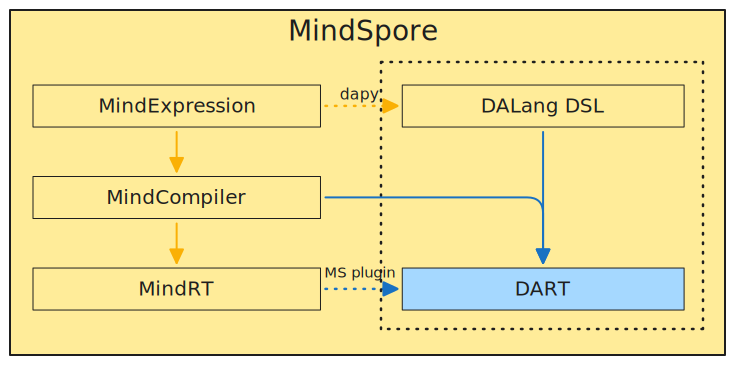

# DART

#### Description
DART project is a collection of programming language, intermediate representation, and runtime, designed for AI (abbreviated as DA). The key task is to provide a light-weight and high-performance runtime for MindSpore in the inference phase. It's under development by now.

#### Software Architecture

#### Instructions
bash build.sh
