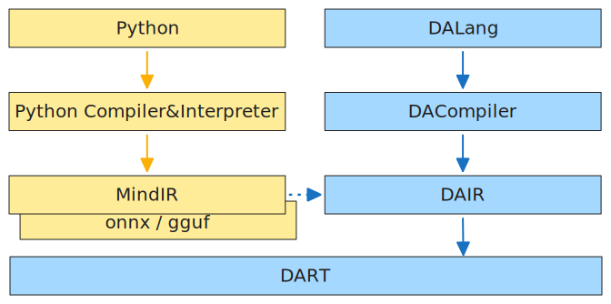

# dalang

#### Description
DALang project is a collection of programming language, intermediate representation, and runtime, designed for AI (abbreviated as DA).

#### Software Architecture

#### Instructions
bash build.sh
