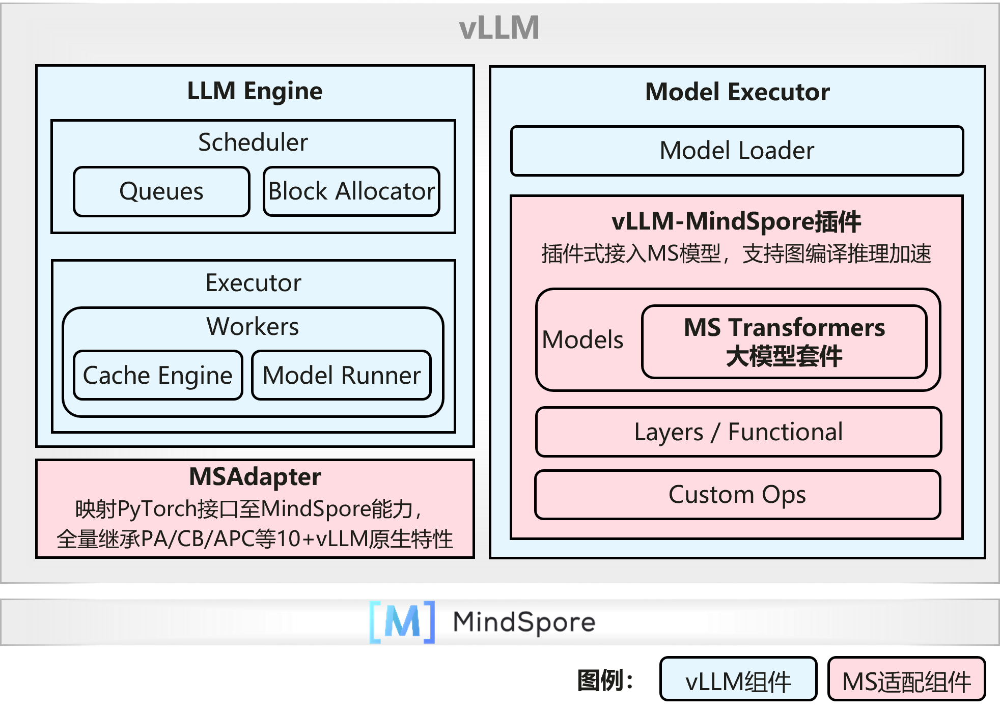

<h1 align="center">
vLLM-MindSpore Plugin
</h1>

<p align="center">
| <a href="https://www.mindspore.cn/"><b>关于MindSpore</b></a> | <a href="https://www.mindspore.cn/vllm_mindspore/docs/zh-CN/master/index.html"><b>文档</b></a> | <a href="https://www.mindspore.cn/community/SIG"><b>LLM Infercence Serving SIG</b></a> | <a href="https://gitee.com/mindspore/vllm-mindspore/issues"><b>问题反馈</b></a> |
</p>

<p align="center">
<a href="README_en.md"><b>English</b></a> | <a href="README.md"><b>中文</b></a>
</p>

---
*最新消息* 🔥

- [2025/08] 适配vLLM [v0.9.1](https://github.com/vllm-project/vllm/releases/tag/v0.9.1)，新增支持LogProbs参数、Qwen2.5-VL模型。
- [2025/06] 适配vLLM [v0.8.3](https://github.com/vllm-project/vllm/releases/tag/v0.8.3)，新增支持vLLM V1架构、Qwen3大模型。
- [2025/04] 完成vLLM [v0.7.3](https://github.com/vllm-project/vllm/releases/tag/v0.7.3)适配，新增支持Automatic Prefix Caching、Chunked Prefill、Multi-step Scheduling、MTP等特性。联合openEuler社区和上海交通大学，实现DeepSeek全栈开源单机推理部署，你可以在[这里](https://www.openeuler.org/zh/news/openEuler/20240421-jd/20240421-jd.html)阅读详细报道。
- [2025/03] 完成vLLM [v0.6.6.post1](https://github.com/vllm-project/vllm/releases/tag/v0.6.6.post1)适配，支持采用`vllm.entrypoints`部署基于MindSpore的DeepSeek-V3/R1、Qwen2.5等大模型推理服务。联合openEuler社区和北京大学，发布全栈开源DeepSeek推理方案，你可以在[这里](https://news.pku.edu.cn/xwzh/e13046c47d03471c8cebb950bd1f4598.htm)阅读详细报道。
- [2025/02] MindSpore社区正式创建了[mindspore/vllm-mindspore](https://gitee.com/mindspore/vllm-mindspore)代码，旨在将MindSpore大模型推理能力接入vLLM。

---

## 简介

vLLM-MindSpore插件（`vllm-mindspore`）是一个由[MindSpore社区](https://www.mindspore.cn/)孵化的vLLM后端插件。其将基于MindSpore构建的大模型推理能力接入[vLLM](https://github.com/vllm-project/vllm)，从而有机整合MindSpore和vLLM的技术优势，提供全栈开源、高性能、易用的大模型推理解决方案。

vLLM-MindSpore插件以将MindSpore大模型接入vLLM，并实现服务化部署为功能目标。其遵循以下设计原则：

- 接口兼容：支持vLLM原生的API和服务部署接口，避免新增配置文件或接口，降低用户学习成本和确保易用性。
- 最小化侵入式修改：尽可能避免侵入式修改vLLM代码，以保障系统的可维护性和可演进性。
- 组件解耦：最小化和规范化MindSpore大模型组件和vLLM服务组件的耦合面，以利于多种MindSpore大模型套件接入。

基于上述设计原则，vLLM-MindSpore插件采用如下图所示的系统架构，分组件类别实现vLLM与MindSpore的对接：

- 服务化组件：通过将LLM Engine、Scheduler等服务化组件中的PyTorch API调用映射至MindSpore能力调用，继承支持包括Continuous Batching、PagedAttention在内的服务化功能。
- 大模型组件：通过注册或替换模型、网络层、自定义算子等组件，将MindSpore Transformers、MindSpore One等MindSpore大模型套件和自定义大模型接入vLLM。

<div align="center">
  
</div>

vLLM-MindSpore插件采用vLLM社区推荐的插件机制，实现能力注册。未来期望遵循[RPC Multi-framework support for vllm](https://gitee.com/mindspore/vllm-mindspore/issues/IBTNRG)所述原则。

## 环境准备

- 硬件：Atlas 800I A2推理服务器，或Atlas 800T A2推理服务器，已安装必要的驱动程序，并可连接至互联网
- 操作系统：openEuler或Ubuntu Linux
- 软件：
    - Python >= 3.9, < 3.12
    - CANN >= 8.0.0.beta1
    - MindSpore
    - vLLM

注：请参考[版本配套](https://www.mindspore.cn/vllm_mindspore/docs/zh-CN/master/getting_started/installation/installation.html)，以获取详细的软件版本配套信息。

## 快速体验

首先请根据[安装指南](https://www.mindspore.cn/vllm_mindspore/docs/zh-CN/master/getting_started/installation/installation.html)选择安装方式。环境安装成功后，运行如下命令启动vLLM服务和使用Qwen/Qwen3-8B模型：

```bash
vllm-mindspore serve Qwen/Qwen3-8B
```

请查看[快速体验](https://www.mindspore.cn/vllm_mindspore/docs/zh-CN/master/getting_started/quick_start/quick_start.html)和[安装指南](https://www.mindspore.cn/vllm_mindspore/docs/zh-CN/master/getting_started/installation/installation.html)了解更多。

## 镜像构建

可使用以下命令构建vLLM-MindSpore插件的配套Docker镜像，通过参数-a选择相应的NPU类型进行构建，`device_type`表示设备类型，`910b` 为Atlas A2系列，`310p` 为Atlas 300I Pro/Duo和Atlas 300V Pro系列，默认为 `910b`：

```bash
bash build_image.sh -a device_type
```

## 贡献

请参考 [CONTRIBUTING](https://gitee.com/mindspore/vllm-mindspore/blob/master/CONTRIBUTING_CN.md) 文档了解更多关于开发环境搭建、功能测试以及 PR 提交规范的信息。

我们欢迎并重视任何形式的贡献与合作，请通过[Issue](https://gitee.com/mindspore/vllm-mindspore/issues)来告知我们您遇到的任何Bug，或提交您的特性需求、改进建议、技术方案。

## SIG组织

- 欢迎加入LLM Infercence Serving SIG，参与开源项目共建和产业合作：[https://www.mindspore.cn/community/SIG](https://www.mindspore.cn/community/SIG)
- SIG例会，双周周三或周四下午，16:30 - 17:30 (UTC+8, [查看您的时区](https://dateful.com/convert/gmt8?t=15))
