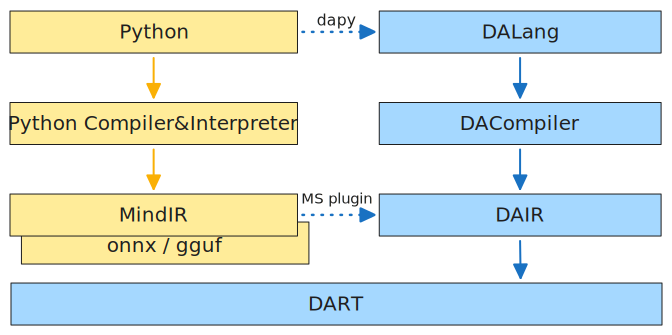

# DALang

#### Description
DALang project is a collection of programming language, intermediate representation, and runtime, designed for AI (abbreviated as DA). It's under development by now.

#### Software Architecture

#### Instructions
bash build.sh
