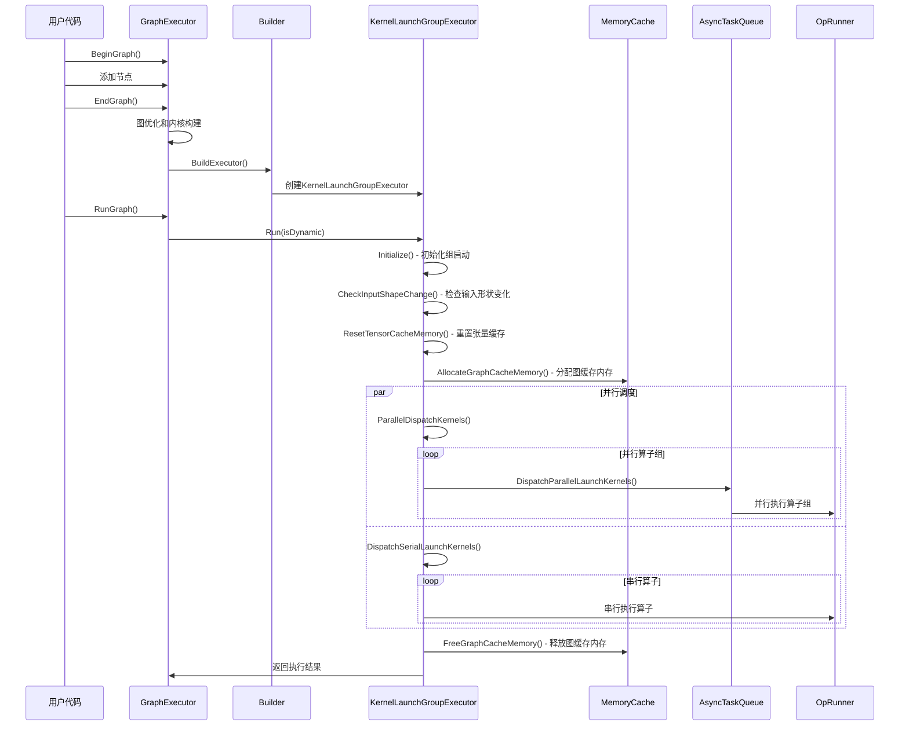

# MS-InferRT View执行引擎

## 1. Executor - 执行器基类

`Executor` 提供计算图执行的基本接口。

**执行模式**:

```cpp
enum ExecutionMode : size_t {
    Base = 0,        // 基础执行模式
    Pipeline = 1,     // 流水线执行模式
    GroupLaunch = 2,  // 分组启动模式
};
```

**核心方法**:

```cpp
class Executor {
    virtual void Run(bool isDynamic);
protected:
    std::shared_ptr<std::vector<OpRunner>> opRunners_;
    std::map<hardware::DeviceType, device::DeviceContext *> deviceContexts_;
};
```

## 2. Builder - 执行器构建器

`Builder` 负责构建可执行的计算图。

**构建流程**:

```text
Graph
    ↓
SetupOpRunners()
    ├── CreateOpRunners()
    ├── UpdateRefNodeOutputValue()
    └── RecordStorageFreePoint()
    ↓
BuildExecutor()
    ↓
Executor
```

**核心方法**:

- `BuildExecutor()`: 构建执行器
- `CreateOpRunners()`: 为所有节点创建 OpRunner
- `UpdateRefNodeOutputValue()`: 更新引用节点的输出值
- `RecordStorageFreePoint()`: 记录存储释放点以优化内存

## 3. GraphExecutor - 图执行器

`GraphExecutor` 提供完整的图构建、优化和执行流程。

**执行流程**:

```text
1. BeginGraph()
2. AddParameter()
3. AddOpNode()
4. AddReturnNode()
5. EndGraph()
6. OptGraph()          // 图优化
7. BuildKernels()       // 构建 Kernel
8. BuildExecutor()      // 构建执行器
9. RunGraph()          // 执行图
```

**核心方法**:

- `BeginGraph()`, `EndGraph()`: 图构建生命周期
- `AddParameter()`, `AddOpNode()`, `AddReturnNode()`: 图节点添加
- `OptGraph()`: 运行优化 Pass
- `BuildKernels()`: 为节点构建 Kernel
- `RunGraph()`: 执行计算图
- `FreeGraphOutputs()`: 释放输出内存

**动态shape支持**:

- `RunGraph(bool isDynamic)`: 支持动态shape执行

### 3.1 串行执行模式


### 3.2 流水执行模式


### 3.3 并行下发执行模式


